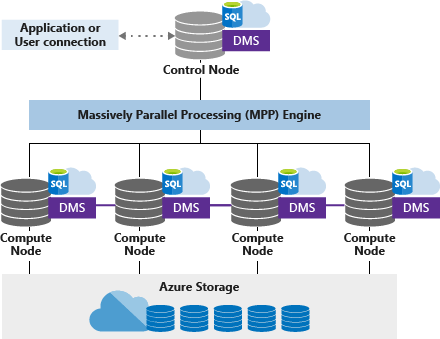

# Notes: Azure Dedicated SQL Pool optimization

# TOC
1. [Data distribution](#1-data-distribution)
2. [Index Options](#2-index-options)
3. [Table Partitioning](#3-table-partitioning)
4. [SQL Operations](#4-sql-operations)
   1. [Setup](#40-setup)
   2. [Data distribution](#41-distribution)
   3. [Index Options](#42-index-options)
   4. [Table Partitioning](#43-table-partitioning)

# 1. Data distribution



- Control node (master) and compute nodes (workers)
- Control node comes up with a distributed query plan and asks each of the control nodes to execute their part
- DMS (Data Movement Service) moves data between these nodes
- A Distributed table is divided into 60 distributions (buckets) are distributed among compute nodes
- A Distributed table can be Round Robin (default) or based on a deterministic/consistent hash of the column provided

| Data warehouse units | # of compute nodes | # of distributions per node | Memory (GB) | Maximum concurrent queries |
|----------------------|--------------------|-----------------------------|-------------|----------------------------|
| DW100c               | 1                  | 60                          | 60          | 4                          |
| DW200c               | 1                  | 60                          | 120         | 8                          |
| DW300c               | 1                  | 60                          | 180         | 12                         |
| DW400c               | 1                  | 60                          | 240         | 16                         |
| DW500c               | 1                  | 60                          | 300         | 20                         |
| DW1000c              | 2                  | 30                          | 600         | 32                         |
| DW1500c              | 3                  | 20                          | 900         | 32                         |
| DW2000c              | 4                  | 15                          | 1200        | 48                         |
| DW2500c              | 5                  | 12                          | 1500        | 48                         |
| DW3000c              | 6                  | 10                          | 1800        | 64                         |
| DW5000c              | 10                 | 6                           | 3000        | 64                         |
| DW6000c              | 12                 | 5                           | 3600        | 128                        |
| DW7500c              | 15                 | 4                           | 4500        | 128                        |
| DW10000c             | 20                 | 3                           | 6000        | 128                        |
| DW15000c             | 30                 | 2                           | 9000        | 128                        |
| DW30000c             | 60                 | 1                           | 18000       | 128                        |

[Source](https://learn.microsoft.com/en-us/azure/synapse-analytics/sql-data-warehouse/memory-concurrency-limits)

## Round Robin table -
- There is no data skewness as all rows are distributed equally
- Rows with equal values are not guaranteed to be assigned to the same distribution so data movement is involved during query processing
- Data shuffling takes most of the time in query execution
- When to use?
  - As a default starting point
  - When there is no obvious distribution key (either no obvious join key, or no good candidate column)
  - When table does not share a common join key with other tables
  - If join is less significant than other joins in the query
  - For temporary staging tables - can provide faster create times

## Hash distributed table -
- Data shuffling is minimized when grouping by or joining with the distribution key because of co-location
- Hash distribution column should have high cardinality (more distinct values, at least 60) and an even distribution of values (i.e. roughly similar number of rows for each value)
- Avoid distribution on date column (as it can result in under utilisation of compute resources) or column with high numbers of null/default values
- Pick distribution column that minimizes data movement and avoids data skewness
- Distribution column - column that is frequently used for join, group by, distinct, over, and having clause, and not for where clause
- Distribution column is not updatable, i.e. a new table would need to be created to update it
- Updates to data in the distribution column can result in data-shuffle operations
- When to use?
  - When table size on disk is more than 2 GB, ideal for large fact tables > 2TB
  - When table has frequent insert/update/delete operations

## Replicated table -
- Has full copy on each compute node
- If update occurs, tables need to be copied and indexes need to be rebuilt on each node, which is costly
- When to use?
  - ideal for small dimension tables < 2GB compressed, and if the data is static even bigger tables
- When not to use?
  - Data is frequently updated
  - DW is scaled frequently, adding more compute nodes would trigger rebuild of table on the new nodes
  - May not work well in cases where there are large number of columns but only a few columns are ever queried

## Guidelines for Dimension tables -
- Small dimension table (< 60M rows) - Round Robin with Clustered index / Replicated tables
- Large dimension table - Clustered columnstore index, Hash distributed on join key

## External Table (Polybase feature) -
- TBD

# 2. Index Options

Types of stores -

- Row stores
  - Data for all the columns in a given row is stored on a single page
  - Good for selective queries where a few rows are selected and all columns are needed
- Column stores
  - Data for all the rows for a given column is stored on a single page
  - Works best for analytical workloads, where large number of rows are selected but only with few columns

Index options in Dedicated SQL Pool -

- Row Store
  - Heap
  - Clustered Index
  - Non-Clustered Index
- Column store 
  - Clustered Columnstore Index (default)

## Row Store: Heap tables
- No cluster index, No logical order for storing the rows, Append only
- Faster target for loading data then clustered index tables (can be used as a staging table for large unordered insert operations)
- One or more narrow (with few columns) non-cluster index can be created to optimize read, depending on the search query

## Row Store: Indexes (clustered and non-clustered)
- Uses a B-tree to organize data
- Gets fragmented overtime, requires more maintenance
- Ideal for limited range scans and single selects
- Slower for table scans / partition scans / loading data

### Clustered Index
- Data gets sorted on the basis of a clustered index (which can have one or more columns)
- You can only have one clustered index per table, the table is referred to as a clustered table

### Non-clustered Index
- Index key values are sorted separately from the data rows, and stored
- Each index key value has a pointer to the corresponding data row 

### Tips
- For analytical workloads, a clustered table is typically created for small dimension tables
- And narrow non-clustered index that covers the search parameters in the query (on either clustered table or a heap table)
- However, the more non-clustered indexes we create, the longer it will take to load data into the table (should also apply to inserts/updates/deletes) 
- Need to strike a balance between query performance and data load performance

## Clustered Columnstore Index

- Data first gets divided into row-groups (ideally ~1M rows per group)
- Then for each of the columns there is a column segment
- Compression gets applied to each column segment, and columnstore data is generated and stored with the table data

Analytical workloads run faster because -
- Data reads are eliminated in cases where all columns are not selected 
- For a given column the values are highly likely to be repeated, which results in better compression
- SQL Engine's Batch mode processing operator, which processes 1 bach row of data instead of 1 row at a time, is optimised for multicore architecture

### Row Groups

Row groups can exist in following states
- Open: (in delta-store) accepting new rows, data is not compressed or indexed
- Closed: (in delta-store) not accepting new rows
- Compressed: in Column store format
- Tombstone: when all data in a row-group is deleted


### Updates
- CCIs maximize compression
- Expensive to update
- Mechanisms for handling updates include -
  - Delete Bitmap (soft logical delete, rebuilding of index is needed)
  - Delta Stores - row store table that holds rows until number of rows is large enough to store in column store
  - In a bulk load operation most rows can skip delta store 

# TBD

### Tips
- Although number of rows should be 1M per row group with a lower threshold being 102k rows, sometimes fewer rows are contained in a row group
- This is because sufficient resources were not available while creating the table (the fix is to rebuild index with higher resources)
- Segment quality is most optimal where there are at least 100 K rows per compressed row group and gain in performance as the number of rows per row group approach 1,048,576 rows, which is the most rows a row group can contain.
- Clustered indexes may outperform clustered columnstore tables when a single row needs to be quickly retrieved
- Columnstore tables do not support varchar(max), nvarchar(max), and varbinary(max). Consider heap or clustered index instead.
- Columnstore tables may be less efficient for transient data. Consider heap and perhaps even temporary tables.
- For small tables with less than 60 million rows. Consider heap tables.
- Cluster columnstore tables begin to achieve optimal compression once there is more than 60 million rows. For small lookup tables, less than 60 million rows, consider using HEAP or clustered index for faster query performance.


# 3. Table partitioning

- Dividing data into partitions, can only be done on one column
- Typically done on the date column (column that is typically filtered by in queries) - tied to the order of data loading
- Can improve query performance by eliminating partitions that are not necessary
- Makes data loading simple by switch-in/switch-out methods, and can make lifecycle management efficient

## Range partitioning

- we define boundary points by which the partitions will be created
- Range Right - includes boundary point on the partition right to the point
- Range Left - includes boundary point on the partition left to the point

So if boundary points are 1, 2, 3
- Range Right partitions will be <1 | >=1 & <2 | >=2 & <3 | >=3
- Range Left partitions will be <=1 | >1 & <=2 | >2 & <=3 | >3
- Number of partitions = number of boundary points + 1

## Partitioning Tips

- Be careful of over-partitioning as
  - data is already spread across 60 distributions
  - columnstore index row groups upto ~1M rows (1,048,576) for optimal compression
  - so ideally we should have 60M rows per partition (1M rows per partition per distribution)
- Partition where lifecycle management is needed
  - Sliding window deployment - incoming data being added to one side of the table
  - Targeted index rebuilds - can rebuild indexes for specific partition as needed


# 4. SQL Operations

## 4.0 Setup

Following is the one time setup needed to import the Sample Contoso database

```sql
/*
	Sample Contoso database can be installed from here:
	https://docs.microsoft.com/en-us/azure/synapse-analytics/sql-data-warehouse/sql-data-warehouse-load-from-azure-blob-storage-with-polybase
	https://github.com/microsoft/sql-server-samples/blob/master/samples/databases/contoso-data-warehouse/load-contoso-data-warehouse-to-sql-data-warehouse.sql
*/

-- A: Create a master key.
-- Only necessary if one does not already exist.
-- Required to encrypt the credential secret in the next step.

CREATE MASTER KEY;

-- Create an external data source
-- TYPE: HADOOP - PolyBase uses Hadoop APIs to access data in Azure blob storage.
-- LOCATION: Provide Azure storage account name and blob container name.
-- CREDENTIAL: Provide the credential created in the previous step.

CREATE EXTERNAL DATA SOURCE AzureStorage_west_public
WITH 
(  
    TYPE = Hadoop 
,   LOCATION = 'wasbs://contosoretaildw-tables@contosoretaildw.blob.core.windows.net/'
); 
GO

-- The data is stored in text files in Azure blob storage, and each field is separated with a delimiter. 
-- Run this [CREATE EXTERNAL FILE FORMAT][] command to specify the format of the data in the text files. 
-- he Contoso data is uncompressed and pipe delimited.

CREATE EXTERNAL FILE FORMAT TextFileFormatContoso 
WITH 
(   FORMAT_TYPE = DELIMITEDTEXT
,	FORMAT_OPTIONS	(   FIELD_TERMINATOR = '|'
                    ,	STRING_DELIMITER = ''
                    ,	DATE_FORMAT		 = 'yyyy-MM-dd HH:mm:ss.fff'
                    ,	USE_TYPE_DEFAULT = FALSE 
                    )
);
GO

-- To create a place to store the Contoso data in your database, create a schema
-- for external tables and a schema for internal tables.
CREATE SCHEMA [asb]
GO
CREATE SCHEMA [cso]
GO
```

## 4.1 Distribution

### Get node & distribution info
```sql
--Part 1
SELECT  [pdw_node_id]   AS node_id
,       [type]          AS node_type
,       [name]          AS node_name
FROM    sys.[dm_pdw_nodes];

SELECT  [distribution_id]   AS dist_id
,       [pdw_node_id]       AS node_id
,       [name]              AS dist_name
,       [position]          AS dist_position
FROM    sys.[pdw_distributions];
```

### Create an external table (Polybase feature)
```sql
--Part 2
CREATE EXTERNAL TABLE [asb].FactOnlineSales
(
    [OnlineSalesKey] [int]  NOT NULL,
    [DateKey] [datetime] NOT NULL,
    [StoreKey] [int] NOT NULL,
    [ProductKey] [int] NOT NULL,
    [PromotionKey] [int] NOT NULL,
    [CurrencyKey] [int] NOT NULL,
    [CustomerKey] [int] NOT NULL,
    [SalesOrderNumber] [nvarchar](20) NOT NULL,
    [SalesOrderLineNumber] [int] NULL,
    [SalesQuantity] [int] NOT NULL,
    [SalesAmount] [money] NOT NULL,
    [ReturnQuantity] [int] NOT NULL,
    [ReturnAmount] [money] NULL,
    [DiscountQuantity] [int] NULL,
    [DiscountAmount] [money] NULL,
    [TotalCost] [money] NOT NULL,
    [UnitCost] [money] NULL,
    [UnitPrice] [money] NULL,
    [ETLLoadID] [int] NULL,
    [LoadDate] [datetime] NULL,
    [UpdateDate] [datetime] NULL
)
WITH
(
    LOCATION='/FactOnlineSales/'
,   DATA_SOURCE = AzureStorage_west_public
,   FILE_FORMAT = TextFileFormatContoso
,   REJECT_TYPE = VALUE
,   REJECT_VALUE = 0
);
```

### Create round-robin table and hash table
```sql
--Create Tables - takes time based on data volume, performance level and resource class
CREATE TABLE [cso].[FactOnlineSalesRR]       
WITH (DISTRIBUTION = ROUND_ROBIN) --Round Robin
AS 
SELECT * FROM [asb].[FactOnlineSales]        
OPTION (LABEL = 'CTAS : Load [cso].[FactOnlineSalesRR]');

CREATE TABLE [cso].[FactOnlineSalesHash]       
WITH (DISTRIBUTION = HASH([ProductKey])) --Hash Distributed
AS 
SELECT * FROM [asb].[FactOnlineSales]        
OPTION (LABEL = 'CTAS : Load [cso].[FactOnlineSalesHash]');

--Create necessary statistics
```

### Create the dbo.vTableSizes view, and analyse the table's properties
```sql
/*
	Create the dbo.vTableSizes with the source code available here:
	https://docs.microsoft.com/en-us/azure/synapse-analytics/sql-data-warehouse/sql-data-warehouse-tables-overview#table-size-queries
*/
SELECT pdw_node_id, schema_name, table_name, node_table_name, distribution_id, 
	row_count, distribution_policy_name, distribution_column, index_type_desc,
	reserved_space_GB, unused_space_GB, data_space_GB, index_space_GB
FROM dbo.vTableSizes
WHERE table_name = 'FactOnlineSalesRR'
ORDER BY distribution_id

SELECT pdw_node_id, schema_name, table_name, node_table_name, distribution_id, 
	row_count, distribution_policy_name, distribution_column, index_type_desc,
	reserved_space_GB, unused_space_GB, data_space_GB, index_space_GB
FROM dbo.vTableSizes
WHERE table_name = 'FactOnlineSalesHash'
ORDER BY distribution_id
```

### A group by product key query for both tables
```sql
--Query Tables and look at estimated execution plan
SELECT [ProductKey], Sum([SalesAmount]) 
FROM [cso].[FactOnlineSalesRR] --Round Robin
GROUP BY ProductKey
ORDER BY ProductKey
GO
SELECT [ProductKey], Sum([SalesAmount]) 
FROM [cso].[FactOnlineSalesHash] --Hash Distributed
GROUP BY ProductKey
ORDER BY ProductKey
GO
```

### Analyze Query Plans for both queries

- This will give an XML output.
- You will observe that round-robin query has a shuffle step which takes most of the time
- While the hash distributed table has no shuffle operation
- You can also check this plan in Azure Synapse Studio > Monitor, where all the queries that have been executed appear

```sql
--Analyze Plans
EXPLAIN SELECT [ProductKey], Sum([SalesAmount]) 
FROM [cso].[FactOnlineSalesRR] --Round Robin
GROUP BY ProductKey
ORDER BY ProductKey
GO
EXPLAIN SELECT [ProductKey], Sum([SalesAmount]) 
FROM [cso].[FactOnlineSalesHash] --Hash Distributed
GROUP BY ProductKey
ORDER BY ProductKey
GO
```

### Joining the Tables

#### Create another table to join to
```sql
--Joining Hash Tables
CREATE EXTERNAL TABLE [asb].DimProduct (
    [ProductKey] [int] NOT NULL,
    [ProductLabel] [nvarchar](255) NULL,
    [ProductName] [nvarchar](500) NULL,
    [ProductDescription] [nvarchar](400) NULL,
    [ProductSubcategoryKey] [int] NULL,
    [Manufacturer] [nvarchar](50) NULL,
    [BrandName] [nvarchar](50) NULL,
    [ClassID] [nvarchar](10) NULL,
    [ClassName] [nvarchar](20) NULL,
    [StyleID] [nvarchar](10) NULL,
    [StyleName] [nvarchar](20) NULL,
    [ColorID] [nvarchar](10) NULL,
    [ColorName] [nvarchar](20) NOT NULL,
    [Size] [nvarchar](50) NULL,
    [SizeRange] [nvarchar](50) NULL,
    [SizeUnitMeasureID] [nvarchar](20) NULL,
    [Weight] [float] NULL,
    [WeightUnitMeasureID] [nvarchar](20) NULL,
    [UnitOfMeasureID] [nvarchar](10) NULL,
    [UnitOfMeasureName] [nvarchar](40) NULL,
    [StockTypeID] [nvarchar](10) NULL,
    [StockTypeName] [nvarchar](40) NULL,
    [UnitCost] [money] NULL,
    [UnitPrice] [money] NULL,
    [AvailableForSaleDate] [datetime] NULL,
    [StopSaleDate] [datetime] NULL,
    [Status] [nvarchar](7) NULL,
    [ImageURL] [nvarchar](150) NULL,
    [ProductURL] [nvarchar](150) NULL,
    [ETLLoadID] [int] NULL,
    [LoadDate] [datetime] NULL,
    [UpdateDate] [datetime] NULL
)
WITH
(
    LOCATION='/DimProduct/'
,   DATA_SOURCE = AzureStorage_west_public
,   FILE_FORMAT = TextFileFormatContoso
,   REJECT_TYPE = VALUE
,   REJECT_VALUE = 0
)
;

CREATE TABLE [cso].[DimProductProductKey]            
WITH (DISTRIBUTION = HASH([ProductKey])) 
AS 
SELECT * FROM [asb].[DimProduct] 
OPTION (LABEL = 'CTAS : Load [cso].[DimProductProductKey]');
GO

CREATE TABLE [cso].[DimProductProductLabel]            
WITH (DISTRIBUTION = HASH([ProductLabel])) 
AS 
SELECT * FROM [asb].[DimProduct] 
OPTION (LABEL = 'CTAS : Load [cso].[DimProductProductLabel]');
GO

CREATE TABLE [cso].[DimProductRR]            
WITH (DISTRIBUTION = ROUND_ROBIN) 
AS 
SELECT * FROM [asb].[DimProduct] 
OPTION (LABEL = 'CTAS : Load [cso].[DimProductRR]');
GO
```

#### Join with different tables and analyse plan on Synapse Studio

- You will observe that when joining with compatible join key there is no shuffle involved, and in other case shuffle is involved
- Also, synapse has identified that the dim table is smaller, so it broadcasts it the all the compute nodes and performs a broadcast join

```sql
--Join with compatible join key
SELECT   p.[ProductKey], SUM(f.[SalesAmount]) 
FROM    [cso].[FactOnlineSalesHash] AS f
JOIN    [cso].[DimProductProductKey] AS p ON f.[ProductKey] = p.[ProductKey]
GROUP BY p.[ProductKey]
GO

--Join with incompatible join key
SELECT  SUM(f.[SalesAmount]) 
,       p.[ProductKey]
FROM    [cso].[FactOnlineSalesHash] AS f
JOIN    [cso].[DimProductProductLabel] AS p ON f.[ProductKey] = p.[ProductKey]
GROUP BY p.[ProductKey]
GO
```

### Data Skewness Example

#### Create table hash distributed on StoreKey which has only 3 distinct values
```sql
--The rows per distribution can vary up to 10% without a noticeable impact on performance.
CREATE TABLE [cso].[FactOnlineSalesHashStoreKey]       
WITH (DISTRIBUTION = HASH([StoreKey])) --Hash Distributed
AS 
SELECT * FROM [asb].[FactOnlineSales]        
OPTION (LABEL = 'CTAS : Load [cso].[FactOnlineSalesHashStoreKey]');
```

#### Analyze the distributed sub-tables
You will observe that all rows have been distributed to just 3 distributions instead of 60
```sql
SELECT pdw_node_id, schema_name, table_name, node_table_name, distribution_id, 
	row_count, distribution_policy_name, distribution_column, index_type_desc,
	reserved_space_GB, unused_space_GB, data_space_GB, index_space_GB
FROM dbo.vTableSizes
WHERE table_name = 'FactOnlineSalesHashStoreKey'
ORDER BY pdw_node_id
```

### Replicated Table
#### Join on Round Robin table on RR fact table
If you analyse the query, you will observe data shuffling operation, as well as a broadcast move of the smaller table 
```sql
--Join with RR tables
SELECT   p.[ProductKey], SUM(f.[SalesAmount]) 
FROM    [cso].[FactOnlineSalesRR] AS f
JOIN    [cso].[DimProductRR] AS p ON f.[ProductKey] = p.[ProductKey]
GROUP BY p.[ProductKey]
GO
```

#### Create a Replicated Table
```sql
CREATE TABLE [cso].[DimProductReplicate]            
WITH (DISTRIBUTION = Replicate) 
AS 
SELECT * FROM [asb].[DimProduct] 
OPTION (LABEL = 'CTAS : Load [cso].[DimProductReplicate]')
GO

--To trigger a rebuild, run the following statement on each table in the preceding output
--rebuild reads immediately from the master version of the table while the data is 
--asynchronously copied to each Compute node. Until the data copy is complete, 
--subsequent queries will continue to use the master version of the table.
SELECT TOP 1 * FROM [cso].[DimProductReplicate] ;
```

#### Run join query from Replicated Table on RR fact table
When analysed, You will observe Shuffle operations of the fact table, broadcast move is eliminated
```sql
SELECT   p.[ProductKey], SUM(f.[SalesAmount]) 
FROM    [cso].[FactOnlineSalesRR] AS f
JOIN    [cso].[DimProductReplicate] AS p ON f.[ProductKey] = p.[ProductKey]
GROUP BY p.[ProductKey]
GO
```

#### Run join query from Replicated Table/Product key Hash table on Hash distributed fact table
Both will have no shuffle operations, no broadcast moves
```sql
SELECT   p.[ProductKey], SUM(f.[SalesAmount]) 
FROM    [cso].[FactOnlineSalesHash] AS f
JOIN    [cso].[DimProductProductKey] AS p ON f.[ProductKey] = p.[ProductKey]
GROUP BY p.[ProductKey]
GO
SELECT   p.[ProductKey], SUM(f.[SalesAmount]) 
FROM    [cso].[FactOnlineSalesHash] AS f
JOIN    [cso].[DimProductReplicate] AS p ON f.[ProductKey] = p.[ProductKey]
GROUP BY p.[ProductKey]
GO

```

### Clean up

```sql
--Clean up objects created in this example
DROP EXTERNAL TABLE [asb].FactOnlineSales
DROP TABLE [cso].[FactOnlineSalesRR]
DROP TABLE [cso].[FactOnlineSalesHash]
DROP TABLE [cso].[FactOnlineSalesHashStoreKey]
DROP EXTERNAL TABLE [asb].DimProduct
DROP TABLE [cso].[DimProductRR]
DROP TABLE [cso].[DimProductProductKey]            
DROP TABLE [cso].[DimProductProductLabel]
DROP TABLE [cso].[DimProductReplicate]
GO
--DROP EXTERNAL FILE FORMAT TextFileFormatContoso
--DROP EXTERNAL DATA SOURCE AzureStorage_west_public
--GO
--DROP SCHEMA [asb]
--GO
--DROP SCHEMA [cso]
--GO
```

## 4.2 Index Options

### Part 1 - Columnstore index (default), Heap, Clustered and non-clustered Indexes

#### Create an external table
```sql
CREATE EXTERNAL TABLE [asb].DimProduct (
    [ProductKey] [int] NOT NULL,
    [ProductLabel] [nvarchar](255) NULL,
    [ProductName] [nvarchar](500) NULL,
    [ProductDescription] [nvarchar](400) NULL,
    [ProductSubcategoryKey] [int] NULL,
    [Manufacturer] [nvarchar](50) NULL,
    [BrandName] [nvarchar](50) NULL,
    [ClassID] [nvarchar](10) NULL,
    [ClassName] [nvarchar](20) NULL,
    [StyleID] [nvarchar](10) NULL,
    [StyleName] [nvarchar](20) NULL,
    [ColorID] [nvarchar](10) NULL,
    [ColorName] [nvarchar](20) NOT NULL,
    [Size] [nvarchar](50) NULL,
    [SizeRange] [nvarchar](50) NULL,
    [SizeUnitMeasureID] [nvarchar](20) NULL,
    [Weight] [float] NULL,
    [WeightUnitMeasureID] [nvarchar](20) NULL,
    [UnitOfMeasureID] [nvarchar](10) NULL,
    [UnitOfMeasureName] [nvarchar](40) NULL,
    [StockTypeID] [nvarchar](10) NULL,
    [StockTypeName] [nvarchar](40) NULL,
    [UnitCost] [money] NULL,
    [UnitPrice] [money] NULL,
    [AvailableForSaleDate] [datetime] NULL,
    [StopSaleDate] [datetime] NULL,
    [Status] [nvarchar](7) NULL,
    [ImageURL] [nvarchar](150) NULL,
    [ProductURL] [nvarchar](150) NULL,
    [ETLLoadID] [int] NULL,
    [LoadDate] [datetime] NULL,
    [UpdateDate] [datetime] NULL
)
WITH
(
    LOCATION='/DimProduct/'
,   DATA_SOURCE = AzureStorage_west_public
,   FILE_FORMAT = TextFileFormatContoso
,   REJECT_TYPE = VALUE
,   REJECT_VALUE = 0
)
;
```

#### Create a table, by default clustered columnstore index will be created 
```sql
----Default is clustered Columstore index
IF OBJECT_ID('cso.DimProductRR', 'U') IS NOT NULL
    DROP TABLE [cso].[DimProductRR]
GO
CREATE TABLE [cso].[DimProductRR]            
WITH (DISTRIBUTION = ROUND_ROBIN) 
AS 
SELECT * FROM [asb].[DimProduct] 
OPTION (LABEL = 'CTAS : Load [cso].[DimProductRR]');
GO

```

#### We can investigate the table properties/metadata by doing the following
```sql
/*
	Create the dbo.vTableSizes with the source code available here:
	https://docs.microsoft.com/en-us/azure/synapse-analytics/sql-data-warehouse/sql-data-warehouse-tables-overview#table-size-queries
*/
SELECT pdw_node_id, schema_name, table_name, index_type_desc, node_table_name, distribution_id, 
	row_count, distribution_policy_name, distribution_column, 
	reserved_space_GB, unused_space_GB, data_space_GB, index_space_GB
FROM dbo.vTableSizes
WHERE table_name = 'DimProductRR'
ORDER BY distribution_id
```

#### To create a heap table
```sql
----Heap
IF OBJECT_ID('cso.DimProductRR', 'U') IS NOT NULL
    DROP TABLE [cso].[DimProductRR]
GO
CREATE TABLE [cso].[DimProductRR]            
WITH (DISTRIBUTION = ROUND_ROBIN, HEAP) 
AS 
SELECT * FROM [asb].[DimProduct] 
OPTION (LABEL = 'CTAS : Load [cso].[DimProductRR]');
GO
```

#### We can investigate the table properties/metadata by doing the following
```sql
SELECT pdw_node_id, schema_name, table_name, index_type_desc, node_table_name, distribution_id, 
	row_count, distribution_policy_name, distribution_column, 
	reserved_space_GB, unused_space_GB, data_space_GB, index_space_GB
FROM dbo.vTableSizes
WHERE table_name = 'DimProductRR'
ORDER BY distribution_id
```

#### To create a clustered table
```sql
----Clustered Index
IF OBJECT_ID('cso.DimProductRR', 'U') IS NOT NULL
    DROP TABLE [cso].[DimProductRR]
GO
CREATE TABLE [cso].[DimProductRR]            
WITH (DISTRIBUTION = ROUND_ROBIN, CLUSTERED INDEX ([ProductKey])) 
AS 
SELECT * FROM [asb].[DimProduct] 
OPTION (LABEL = 'CTAS : Load [cso].[DimProductRR]');
GO
```

#### We can investigate the table properties/metadata by doing the following
```sql
SELECT pdw_node_id, schema_name, table_name, index_type_desc, node_table_name, distribution_id, 
	row_count, distribution_policy_name, distribution_column, 
	reserved_space_GB, unused_space_GB, data_space_GB, index_space_GB
FROM dbo.vTableSizes
WHERE table_name = 'DimProductRR'
ORDER BY distribution_id
```

#### We can create additional non-clustered indexes to cover our queries
```sql
----Non-Clustered Index
CREATE NONCLUSTERED INDEX IX_DimProduct_ProductSubcategoryKey   
    ON [cso].[DimProductRR] (ProductSubcategoryKey);  
```

#### To check the metadata of the index
In the output you will notice both clustered and non-clustered indexes that we have created
```sql
SELECT 
	s.name, t.name, i.name, i.type_desc
FROM 
    sys.schemas s
INNER JOIN sys.tables t
    ON s.[schema_id] = t.[schema_id]
INNER JOIN sys.indexes i
    ON  t.[object_id] = i.[object_id]
WHERE s.name = 'cso' AND t.name = 'DimProductRR'
```

### Part 2 - Clustered Columnstore Index - rowgroup, column segments

#### Create an external table
```sql
CREATE EXTERNAL TABLE [asb].[FactOnlineSales]
(
    [OnlineSalesKey] [int]  NOT NULL,
    [DateKey] [datetime] NOT NULL,
    [StoreKey] [int] NOT NULL,
    [ProductKey] [int] NOT NULL,
    [PromotionKey] [int] NOT NULL,
    [CurrencyKey] [int] NOT NULL,
    [CustomerKey] [int] NOT NULL,
    [SalesOrderNumber] [nvarchar](20) NOT NULL,
    [SalesOrderLineNumber] [int] NULL,
    [SalesQuantity] [int] NOT NULL,
    [SalesAmount] [money] NOT NULL,
    [ReturnQuantity] [int] NOT NULL,
    [ReturnAmount] [money] NULL,
    [DiscountQuantity] [int] NULL,
    [DiscountAmount] [money] NULL,
    [TotalCost] [money] NOT NULL,
    [UnitCost] [money] NULL,
    [UnitPrice] [money] NULL,
    [ETLLoadID] [int] NULL,
    [LoadDate] [datetime] NULL,
    [UpdateDate] [datetime] NULL
)
WITH
(
    LOCATION='/FactOnlineSales/'
,   DATA_SOURCE = AzureStorage_west_public
,   FILE_FORMAT = TextFileFormatContoso
,   REJECT_TYPE = VALUE
,   REJECT_VALUE = 0
);
```

#### Create internal table
```sql
----Drop existing table
IF OBJECT_ID('cso.FactOnlineSalesRR', 'U') IS NOT NULL
    DROP TABLE [cso].[FactOnlineSalesRR]
----Create Tables - takes time based on data volume, performance level and resource class
CREATE TABLE [cso].[FactOnlineSalesRR]       
WITH (DISTRIBUTION = ROUND_ROBIN, CLUSTERED COLUMNSTORE INDEX) -- Round Robin
AS 
SELECT * FROM [asb].[FactOnlineSales]        
OPTION (LABEL = 'CTAS : Load [cso].[FactOnlineSalesRR]');

----Create necessary statistics
```

#### Analyze - Total rows, row in open, closed and compressed row groups
- You will notice no, Open or closed row groups, all row-groups will be in compressed state
- This is because we just created this table, when we start updating the records we will see row-groups in other states
```sql
SELECT * FROM
(
	SELECT
		s.name AS [Schema Name]
		,t.name AS [Table Name]
		,rg.partition_number AS [Partition Number]
		,SUM(rg.total_rows) AS [Total Rows]
		,SUM(CASE WHEN rg.State = 1 THEN rg.Total_rows Else 0 END) AS [Rows in OPEN Row Groups]
		,SUM(CASE WHEN rg.State = 2 THEN rg.Total_Rows ELSE 0 END) AS [Rows in Closed Row Groups]
		,SUM(CASE WHEN rg.State = 3 THEN rg.Total_Rows ELSE 0 END) AS [Rows in COMPRESSED Row Groups]
	FROM sys.pdw_nodes_column_store_row_groups rg
	  JOIN sys.pdw_nodes_tables pt
		ON rg.object_id = pt.object_id
		AND rg.pdw_node_id = pt.pdw_node_id
		AND pt.distribution_id = rg.distribution_id
	  JOIN sys.pdw_table_mappings tm
		ON pt.name = tm.physical_name
	  INNER JOIN sys.tables t
		ON tm.object_id = t.object_id
	  INNER JOIN sys.schemas s
		ON t.schema_id = s.schema_id
	GROUP BY s.name, t.name, rg.partition_number
) Temp
WHERE [Table Name] = 'FactOnlineSalesRR'
GO
```

#### Analyze - Total rows, deleted rows, percent deleted rows per distribution
You will notice 2 row groups created per distribution
```sql
SELECT IndexMap.object_id,   
  object_name(IndexMap.object_id) AS LogicalTableName,   
  CSRowGroups.*,  
  100*(ISNULL(deleted_rows,0))/total_rows AS PercentDeletedRows,
  i.name AS LogicalIndexName, IndexMap.index_id, NI.type_desc,   
  IndexMap.physical_name AS PhyIndexNameFromIMap
FROM sys.tables AS t  
JOIN sys.indexes AS i  
    ON t.object_id = i.object_id  
JOIN sys.pdw_index_mappings AS IndexMap  
    ON i.object_id = IndexMap.object_id  
    AND i.index_id = IndexMap.index_id  
JOIN sys.pdw_nodes_indexes AS NI  
    ON IndexMap.physical_name = NI.name  
    AND IndexMap.index_id = NI.index_id  
JOIN sys.pdw_nodes_column_store_row_groups AS CSRowGroups  
    ON CSRowGroups.object_id = NI.object_id   
    AND CSRowGroups.pdw_node_id = NI.pdw_node_id  
    AND CSRowGroups.distribution_id = NI.distribution_id
    AND CSRowGroups.index_id = NI.index_id      
WHERE t.name = 'FactOnlineSalesRR'   
ORDER BY object_name(i.object_id), i.name, IndexMap.physical_name, pdw_node_id;  
```

#### Analyze - Number of column segment for each column of the table
You will notice segment count of 120 per segment, (2 row groups pre distribution * 60 distributions)
```sql
SELECT * FROM
(
	SELECT  sm.name           as schema_nm
	,       tb.name           as table_nm
	,       nc.name           as col_nm
	,       nc.column_id
	,       COUNT(*)          as segment_count
	FROM    sys.[schemas] sm
	JOIN    sys.[tables] tb                   ON  sm.[schema_id]          = tb.[schema_id]
	JOIN    sys.[pdw_table_mappings] mp       ON  tb.[object_id]          = mp.[object_id]
	JOIN    sys.[pdw_nodes_tables] nt         ON  nt.[name]               = mp.[physical_name]
	JOIN    sys.[pdw_nodes_partitions] np     ON  np.[object_id]          = nt.[object_id]
											  AND np.[pdw_node_id]        = nt.[pdw_node_id]
											  AND np.[distribution_id]    = nt.[distribution_id]
	JOIN    sys.[pdw_nodes_columns] nc        ON  np.[object_id]          = nc.[object_id]
											  AND np.[pdw_node_id]        = nc.[pdw_node_id]
											  AND np.[distribution_id]    = nc.[distribution_id]
	JOIN    sys.[pdw_nodes_column_store_segments] rg  ON  rg.[partition_id]         = np.[partition_id]
														  AND rg.[pdw_node_id]      = np.[pdw_node_id]
														  AND rg.[distribution_id]  = np.[distribution_id]
														  AND rg.[column_id]        = nc.[column_id]
	GROUP BY    sm.name
	,           tb.name
	,           nc.name
	,           nc.column_id  
) Temp
WHERE table_nm = 'FactOnlineSalesRR' ORDER BY column_id
GO
```

#### Analyze - Number of column segment and rows each column segments of the table
```sql
SELECT distinct o.name, css.hobt_id, css.pdw_node_id, css.distribution_id, 
css.column_id, css.segment_id, css.row_count, css.on_disk_size
FROM sys.pdw_nodes_column_store_segments AS css
JOIN sys.pdw_nodes_partitions AS pnp
    ON css.partition_id = pnp.partition_id
JOIN sys.pdw_nodes_tables AS part
    ON pnp.object_id = part.object_id 
    AND pnp.pdw_node_id = part.pdw_node_id
JOIN sys.pdw_table_mappings AS TMap
    ON part.name = TMap.physical_name
JOIN sys.objects AS o
    ON TMap.object_id = o.object_id
WHERE o.name = 'FactOnlineSalesRR' AND css. column_id = 1 --AND  css.distribution_id = 31
ORDER BY css.pdw_node_id, css.distribution_id, css.column_id, css.segment_id
```

### Part 3 - Updating rows to columnstore index

```sql
SELECT
	s.name AS [Schema Name]
	,t.name AS [Table Name]
	,rg.partition_number AS [Partition Number]
	,rg.total_rows AS [Total Rows]
	,CASE WHEN rg.State = 1 THEN rg.Total_rows Else 0 END AS [Rows in OPEN Row Groups]
	,CASE WHEN rg.State = 2 THEN rg.Total_Rows ELSE 0 END AS [Rows in Closed Row Groups]
	,CASE WHEN rg.State = 3 THEN rg.Total_Rows ELSE 0 END AS [Rows in COMPRESSED Row Groups]
FROM sys.pdw_nodes_column_store_row_groups rg
	JOIN sys.pdw_nodes_tables pt
	ON rg.object_id = pt.object_id
	AND rg.pdw_node_id = pt.pdw_node_id
	AND pt.distribution_id = rg.distribution_id
	JOIN sys.pdw_table_mappings tm
	ON pt.name = tm.physical_name
	INNER JOIN sys.tables t
	ON tm.object_id = t.object_id
	INNER JOIN sys.schemas s
	ON t.schema_id = s.schema_id
WHERE t.name = 'FactOnlineSalesRR'
GO
UPDATE [cso].[FactOnlineSalesRR]
SET [UpdateDate] = [UpdateDate] + 1
GO
SELECT
	s.name AS [Schema Name]
	,t.name AS [Table Name]
	,rg.partition_number AS [Partition Number]
	,rg.total_rows AS [Total Rows]
	,CASE WHEN rg.State = 1 THEN rg.Total_rows Else 0 END AS [Rows in OPEN Row Groups]
	,CASE WHEN rg.State = 2 THEN rg.Total_Rows ELSE 0 END AS [Rows in Closed Row Groups]
	,CASE WHEN rg.State = 3 THEN rg.Total_Rows ELSE 0 END AS [Rows in COMPRESSED Row Groups]
FROM sys.pdw_nodes_column_store_row_groups rg
	JOIN sys.pdw_nodes_tables pt
	ON rg.object_id = pt.object_id
	AND rg.pdw_node_id = pt.pdw_node_id
	AND pt.distribution_id = rg.distribution_id
	JOIN sys.pdw_table_mappings tm
	ON pt.name = tm.physical_name
	INNER JOIN sys.tables t
	ON tm.object_id = t.object_id
	INNER JOIN sys.schemas s
	ON t.schema_id = s.schema_id
WHERE t.name = 'FactOnlineSalesRR'
GO
----Analyze - Total rows, deleted rows, percent deleted rows per distribution
SELECT IndexMap.object_id,   
  object_name(IndexMap.object_id) AS LogicalTableName,   
  CSRowGroups.*,  
  100*(ISNULL(deleted_rows,0))/total_rows AS PercentDeletedRows,
  i.name AS LogicalIndexName, IndexMap.index_id, NI.type_desc,   
  IndexMap.physical_name AS PhyIndexNameFromIMap
FROM sys.tables AS t  
JOIN sys.indexes AS i  
    ON t.object_id = i.object_id  
JOIN sys.pdw_index_mappings AS IndexMap  
    ON i.object_id = IndexMap.object_id  
    AND i.index_id = IndexMap.index_id  
JOIN sys.pdw_nodes_indexes AS NI  
    ON IndexMap.physical_name = NI.name  
    AND IndexMap.index_id = NI.index_id  
JOIN sys.pdw_nodes_column_store_row_groups AS CSRowGroups  
    ON CSRowGroups.object_id = NI.object_id   
    AND CSRowGroups.pdw_node_id = NI.pdw_node_id  
    AND CSRowGroups.distribution_id = NI.distribution_id
    AND CSRowGroups.index_id = NI.index_id      
WHERE t.name = 'FactOnlineSalesRR'   
ORDER BY object_name(i.object_id), i.name, IndexMap.physical_name, pdw_node_id;  
GO

ALTER INDEX ALL ON cso.FactOnlineSalesRR REBUILD
GO

SELECT IndexMap.object_id,   
  object_name(IndexMap.object_id) AS LogicalTableName,   
  CSRowGroups.*,  
  100*(ISNULL(deleted_rows,0))/total_rows AS PercentDeletedRows,
  i.name AS LogicalIndexName, IndexMap.index_id, NI.type_desc,   
  IndexMap.physical_name AS PhyIndexNameFromIMap
FROM sys.tables AS t  
JOIN sys.indexes AS i  
    ON t.object_id = i.object_id  
JOIN sys.pdw_index_mappings AS IndexMap  
    ON i.object_id = IndexMap.object_id  
    AND i.index_id = IndexMap.index_id  
JOIN sys.pdw_nodes_indexes AS NI  
    ON IndexMap.physical_name = NI.name  
    AND IndexMap.index_id = NI.index_id  
JOIN sys.pdw_nodes_column_store_row_groups AS CSRowGroups  
    ON CSRowGroups.object_id = NI.object_id   
    AND CSRowGroups.pdw_node_id = NI.pdw_node_id  
    AND CSRowGroups.distribution_id = NI.distribution_id
    AND CSRowGroups.index_id = NI.index_id      
WHERE t.name = 'FactOnlineSalesRR'   
ORDER BY object_name(i.object_id), i.name, IndexMap.physical_name, pdw_node_id;  
GO
```

### Clean up

```sql
--Clean up objects created in this example
DROP EXTERNAL TABLE [asb].[FactOnlineSales];
DROP TABLE [cso].[FactOnlineSalesRR];
DROP EXTERNAL TABLE [asb].[DimProduct];
DROP TABLE [cso].[DimProductRR];
GO
--DROP EXTERNAL FILE FORMAT TextFileFormatContoso
--DROP EXTERNAL DATA SOURCE AzureStorage_west_public
--GO
--DROP SCHEMA [asb]
--GO
--DROP SCHEMA [cso]
--GO
```

## 4.3 Table Partitioning

### Creating an un-partitioned table

```sql
/*
--DROP EXTERNAL TABLE [asb].[FactOnlineSales];
CREATE EXTERNAL TABLE [asb].[FactOnlineSales]
(
    [OnlineSalesKey] [int]  NOT NULL,
    [DateKey] [datetime] NOT NULL,
    [StoreKey] [int] NOT NULL,
    [ProductKey] [int] NOT NULL,
    [PromotionKey] [int] NOT NULL,
    [CurrencyKey] [int] NOT NULL,
    [CustomerKey] [int] NOT NULL,
    [SalesOrderNumber] [nvarchar](20) NOT NULL,
    [SalesOrderLineNumber] [int] NULL,
    [SalesQuantity] [int] NOT NULL,
    [SalesAmount] [money] NOT NULL,
    [ReturnQuantity] [int] NOT NULL,
    [ReturnAmount] [money] NULL,
    [DiscountQuantity] [int] NULL,
    [DiscountAmount] [money] NULL,
    [TotalCost] [money] NOT NULL,
    [UnitCost] [money] NULL,
    [UnitPrice] [money] NULL,
    [ETLLoadID] [int] NULL,
    [LoadDate] [datetime] NULL,
    [UpdateDate] [datetime] NULL
)
WITH
(
    LOCATION='/FactOnlineSales/'
,   DATA_SOURCE = AzureStorage_west_public
,   FILE_FORMAT = TextFileFormatContoso
,   REJECT_TYPE = VALUE
,   REJECT_VALUE = 0
);

--DROP TABLE [cso].[FactOnlineSales];
CREATE TABLE [cso].[FactOnlineSales]       
WITH (DISTRIBUTION = HASH([ProductKey])) --Hash Distributed
AS 
SELECT * FROM [asb].[FactOnlineSales]        
OPTION (LABEL = 'CTAS : Load [cso].[FactOnlineSales]');

*/
```

```sql
SELECT min(datekey), max(datekey) 
FROM [cso].[FactOnlineSales];

SELECT DISTINCT year(datekey)
FROM [cso].[FactOnlineSales];

SELECT year(datekey), count(*)
FROM [cso].[FactOnlineSales]
GROUP BY year(datekey);
```


### Creating an empty partitioned table

```sql
--DROP TABLE [cso].[FactOnlineSales_PExample]
CREATE TABLE [cso].[FactOnlineSales_PExample] 
(   
	[OnlineSalesKey] [int]  NOT NULL,
    [DateKey] [datetime] NOT NULL,
    [StoreKey] [int] NOT NULL,
    [ProductKey] [int] NOT NULL,
    [PromotionKey] [int] NOT NULL,
    [CurrencyKey] [int] NOT NULL,
    [CustomerKey] [int] NOT NULL,
    [SalesOrderNumber] [nvarchar](20) NOT NULL,
    [SalesOrderLineNumber] [int] NULL,
    [SalesQuantity] [int] NOT NULL,
    [SalesAmount] [money] NOT NULL,
    [ReturnQuantity] [int] NOT NULL,
    [ReturnAmount] [money] NULL,
    [DiscountQuantity] [int] NULL,
    [DiscountAmount] [money] NULL,
    [TotalCost] [money] NOT NULL,
    [UnitCost] [money] NULL,
    [UnitPrice] [money] NULL,
    [ETLLoadID] [int] NULL,
    [LoadDate] [datetime] NULL,
    [UpdateDate] [datetime] NULL
)
WITH 
(   CLUSTERED COLUMNSTORE INDEX
,   DISTRIBUTION = HASH([ProductKey])
,   PARTITION
    (
        [DateKey] RANGE RIGHT FOR VALUES
        (
            '2007-01-01 00:00:00.000','2008-01-01 00:00:00.000'
        ,   '2009-01-01 00:00:00.000','2010-01-01 00:00:00.000'
        )
    )
);
```

### Creating a partitioned table with CTAS

```sql
--DROP TABLE [cso].[FactOnlineSales_Partitioned]
CREATE TABLE [cso].[FactOnlineSales_Partitioned]
WITH
(   CLUSTERED COLUMNSTORE INDEX
,   DISTRIBUTION = HASH([ProductKey])
,   PARTITION
    (
        [DateKey] RANGE RIGHT FOR VALUES
        (
        	'2007-01-01 00:00:00.000','2008-01-01 00:00:00.000'
		,	'2009-01-01 00:00:00.000','2010-01-01 00:00:00.000'
        )
    )
)
AS
SELECT * FROM [cso].[FactOnlineSales];
```

#### Recommended to create statistics on this table for optimal performance

```sql
--UPDATE statistics [cso].[FactOnlineSales_Partitioned]
```

```sql
SELECT year(datekey), count(*)
FROM [cso].[FactOnlineSales_Partitioned]
GROUP BY year(datekey)
ORDER BY year(datekey);
```

#### To check partitions on this table - sys.dm_pdw_nodes_db_partition_stats

```sql
SELECT  pnp.partition_number, sum(nps.[row_count]) AS Row_Count
FROM
   sys.tables t
INNER JOIN sys.indexes i
    ON  t.[object_id] = i.[object_id]
    AND i.[index_id] <= 1 /* HEAP = 0, CLUSTERED or CLUSTERED_COLUMNSTORE =1 */
INNER JOIN sys.pdw_table_mappings tm
    ON t.[object_id] = tm.[object_id]
INNER JOIN sys.pdw_nodes_tables nt
    ON tm.[physical_name] = nt.[name]
INNER JOIN sys.pdw_nodes_partitions pnp 
    ON nt.[object_id]=pnp.[object_id] 
    AND nt.[pdw_node_id]=pnp.[pdw_node_id] 
    AND nt.[distribution_id] = pnp.[distribution_id]
INNER JOIN sys.dm_pdw_nodes_db_partition_stats nps
    ON nt.[object_id] = nps.[object_id]
    AND nt.[pdw_node_id] = nps.[pdw_node_id]
    AND nt.[distribution_id] = nps.[distribution_id]
    AND pnp.[partition_id]=nps.[partition_id]
WHERE t.name='FactOnlineSales_Partitioned'
GROUP BY pnp.partition_number;
```

### Data deletion or archival - Partition Switch Out

#### Create empty table

Boundary point is defined for the range for which data needs to be switched out. for Switching-out this can be skipped
and the data will be switched out to a non-partition table, but is necessary for Switching in

```sql
--DROP TABLE [cso].[FactOnlineSales_out]
CREATE TABLE [cso].[FactOnlineSales_out]
WITH 
(   DISTRIBUTION=HASH ([ProductKey])
,   CLUSTERED COLUMNSTORE INDEX
,   PARTITION ([DateKey] 
    RANGE RIGHT FOR VALUES 	
	(
		'2007-01-01 00:00:00.000'
    ))
)
AS 
SELECT * FROM [cso].[FactOnlineSales_Partitioned] WHERE 1=2;
```

#### Check partition info for the above table
this will show 0 rows in each of the 2 partitions as there is no data
```sql
--Data deletion or archival - Partition Switch Out
SELECT  pnp.partition_number, sum(nps.[row_count]) AS Row_Count
FROM
   sys.tables t
INNER JOIN sys.indexes i
    ON  t.[object_id] = i.[object_id]
    AND i.[index_id] <= 1 /* HEAP = 0, CLUSTERED or CLUSTERED_COLUMNSTORE =1 */
INNER JOIN sys.pdw_table_mappings tm
    ON t.[object_id] = tm.[object_id]
INNER JOIN sys.pdw_nodes_tables nt
    ON tm.[physical_name] = nt.[name]
INNER JOIN sys.pdw_nodes_partitions pnp 
    ON nt.[object_id]=pnp.[object_id] 
    AND nt.[pdw_node_id]=pnp.[pdw_node_id] 
    AND nt.[distribution_id] = pnp.[distribution_id]
INNER JOIN sys.dm_pdw_nodes_db_partition_stats nps
    ON nt.[object_id] = nps.[object_id]
    AND nt.[pdw_node_id] = nps.[pdw_node_id]
    AND nt.[distribution_id] = nps.[distribution_id]
    AND pnp.[partition_id]=nps.[partition_id]
WHERE t.name='FactOnlineSales_out'
GROUP BY pnp.partition_number;
```

#### Switch partition 2 from original table to the out table

This is a meta-data operation, so it will run quickly irrespective of how big the partition is

```sql
ALTER TABLE [cso].[FactOnlineSales_Partitioned] 
SWITCH PARTITION 2 
TO [cso].[FactOnlineSales_out] PARTITION 2;
```

```sql
SELECT min(datekey), max(datekey) 
FROM [cso].[FactOnlineSales_Partitioned];

SELECT  min(datekey), max(datekey) 
FROM [cso].[FactOnlineSales_out];
```

#### Drop/Archive the out table

```sql
--Validate row count for both main and archive tables

DROP TABLE [cso].[FactOnlineSales_out];
```

### Partition Split - create new partition

https://docs.microsoft.com/en-us/azure/synapse-analytics/sql-data-warehouse/sql-data-warehouse-tables-partition#how-to-split-a-partition-that-contains-data

A clustered columnstore table, the table partition must be
empty before it can be split.
1. The most efficient method to split a partition that already contains data is to use a CTAS statement.
2. Consider disabling the columnstore index before issuing the ALTER PARTITION statement,
   then rebuilding the columnstore index after ALTER PARTITION is complete.
3. Use CTAS to create a new table to hold the data (to empty the partition) and the split
   and then finally switch data back in.

#### Split range

This will work in this case as the partition we are splitting does not have any data, would not work otherwise

```sql
ALTER TABLE [cso].[FactOnlineSales_Partitioned] 
SPLIT RANGE ('2011-01-01 00:00:00.000');
```

#### Checking the partition count

This will show one more partition

```sql
SELECT  pnp.partition_number, sum(nps.[row_count]) AS Row_Count
FROM
   sys.tables t
INNER JOIN sys.indexes i
    ON  t.[object_id] = i.[object_id]
    AND i.[index_id] <= 1 /* HEAP = 0, CLUSTERED or CLUSTERED_COLUMNSTORE =1 */
INNER JOIN sys.pdw_table_mappings tm
    ON t.[object_id] = tm.[object_id]
INNER JOIN sys.pdw_nodes_tables nt
    ON tm.[physical_name] = nt.[name]
INNER JOIN sys.pdw_nodes_partitions pnp 
    ON nt.[object_id]=pnp.[object_id] 
    AND nt.[pdw_node_id]=pnp.[pdw_node_id] 
    AND nt.[distribution_id] = pnp.[distribution_id]
INNER JOIN sys.dm_pdw_nodes_db_partition_stats nps
    ON nt.[object_id] = nps.[object_id]
    AND nt.[pdw_node_id] = nps.[pdw_node_id]
    AND nt.[distribution_id] = nps.[distribution_id]
    AND pnp.[partition_id]=nps.[partition_id]
WHERE t.name='FactOnlineSales_Partitioned'
GROUP BY pnp.partition_number;
```

### Incremental data load - Partition Switch In : Scenario 1

Adding an entire new year's worth of data

```sql
--ensure the table definitions match and that the partitions align 
--on their respective boundaries, i.e. the source table must contain 
--the same partition boundaries as the target table 
--Scenario 1
--We are artificially adding data for 2010 by adding 1 year to all data of 2009 
--DROP TABLE [cso].[FactOnlineSales_in]
CREATE TABLE [cso].[FactOnlineSales_in]
WITH
(   CLUSTERED COLUMNSTORE INDEX
,   DISTRIBUTION = HASH([ProductKey])
,   PARTITION
    (
        [DateKey] RANGE RIGHT FOR VALUES
        (
        	'2007-01-01 00:00:00.000','2008-01-01 00:00:00.000'
		,	'2009-01-01 00:00:00.000','2010-01-01 00:00:00.000'
		,	'2011-01-01 00:00:00.000'
        )
    )
)
AS
SELECT [OnlineSalesKey]
	  ,ISNULL(DATEADD(year, 1, [DateKey]), GETDATE()) AS [DateKey]
      ,[StoreKey],[ProductKey],[PromotionKey],[CurrencyKey],[CustomerKey]
      ,[SalesOrderNumber],[SalesOrderLineNumber],[SalesQuantity]
      ,[SalesAmount],[ReturnQuantity],[ReturnAmount],[DiscountQuantity]
      ,[DiscountAmount],[TotalCost],[UnitCost],[UnitPrice]
      ,[ETLLoadID],[LoadDate],[UpdateDate]
FROM   [cso].[FactOnlineSales] stg
WHERE stg.[DateKey] >= '2009-01-01 00:00:00.000'
AND   stg.[DateKey] <  '2010-01-01 00:00:00.000'
```

```sql
SELECT  min(datekey), max(datekey) 
FROM [cso].[FactOnlineSales_in];
```

#### Check partition info for staging table

This will only show data in 2010 partition

```sql
SELECT  pnp.partition_number, sum(nps.[row_count]) AS Row_Count
FROM
   sys.tables t
INNER JOIN sys.indexes i
    ON  t.[object_id] = i.[object_id]
    AND i.[index_id] <= 1 /* HEAP = 0, CLUSTERED or CLUSTERED_COLUMNSTORE =1 */
INNER JOIN sys.pdw_table_mappings tm
    ON t.[object_id] = tm.[object_id]
INNER JOIN sys.pdw_nodes_tables nt
    ON tm.[physical_name] = nt.[name]
INNER JOIN sys.pdw_nodes_partitions pnp 
    ON nt.[object_id]=pnp.[object_id] 
    AND nt.[pdw_node_id]=pnp.[pdw_node_id] 
    AND nt.[distribution_id] = pnp.[distribution_id]
INNER JOIN sys.dm_pdw_nodes_db_partition_stats nps
    ON nt.[object_id] = nps.[object_id]
    AND nt.[pdw_node_id] = nps.[pdw_node_id]
    AND nt.[distribution_id] = nps.[distribution_id]
    AND pnp.[partition_id]=nps.[partition_id]
WHERE t.name='FactOnlineSales_in'
GROUP BY pnp.partition_number;
```

#### Switch partition 5 from staging table to original

```sql
ALTER TABLE [cso].[FactOnlineSales_in] 
SWITCH PARTITION 5 
TO [cso].[FactOnlineSales_Partitioned] PARTITION 5;
```

#### Check partition info for original table

```sql
SELECT  pnp.partition_number, sum(nps.[row_count]) AS Row_Count
FROM
   sys.tables t
INNER JOIN sys.indexes i
    ON  t.[object_id] = i.[object_id]
    AND i.[index_id] <= 1 /* HEAP = 0, CLUSTERED or CLUSTERED_COLUMNSTORE =1 */
INNER JOIN sys.pdw_table_mappings tm
    ON t.[object_id] = tm.[object_id]
INNER JOIN sys.pdw_nodes_tables nt
    ON tm.[physical_name] = nt.[name]
INNER JOIN sys.pdw_nodes_partitions pnp 
    ON nt.[object_id]=pnp.[object_id] 
    AND nt.[pdw_node_id]=pnp.[pdw_node_id] 
    AND nt.[distribution_id] = pnp.[distribution_id]
INNER JOIN sys.dm_pdw_nodes_db_partition_stats nps
    ON nt.[object_id] = nps.[object_id]
    AND nt.[pdw_node_id] = nps.[pdw_node_id]
    AND nt.[distribution_id] = nps.[distribution_id]
    AND pnp.[partition_id]=nps.[partition_id]
WHERE t.name='FactOnlineSales_Partitioned'
GROUP BY pnp.partition_number;
```

### Incremental data load - Partition Switch In : Scenario 2

Adding data for a specific month

```sql
--Scenario 2
CREATE TABLE [cso].[FactOnlineSales_in2]
WITH 
(   DISTRIBUTION=HASH ([ProductKey])
,   CLUSTERED COLUMNSTORE INDEX
PARTITION
    (
        [DateKey] RANGE RIGHT FOR VALUES
        (
        	'2007-01-01 00:00:00.000','2008-01-01 00:00:00.000'
		,	'2009-01-01 00:00:00.000','2010-01-01 00:00:00.000'
		,	'2011-01-01 00:00:00.000'
        )
    )
)
AS
SELECT [OnlineSalesKey]
	  ,[DateKey] AS [DateKey]
      ,[StoreKey],[ProductKey],[PromotionKey],[CurrencyKey],[CustomerKey]
      ,[SalesOrderNumber],[SalesOrderLineNumber],[SalesQuantity]
      ,[SalesAmount],[ReturnQuantity],[ReturnAmount],[DiscountQuantity]
      ,[DiscountAmount],[TotalCost],[UnitCost],[UnitPrice]
      ,[ETLLoadID],[LoadDate],[UpdateDate]
FROM   [cso].[FactOnlineSales] stg
WHERE stg.[DateKey] >= '2010-05-01 00:00:00.000'
AND   stg.[DateKey] <  '2010-05-31 00:00:00.000'
UNION ALL
SELECT *
FROM   [cso].[FactOnlineSales_Partitioned] tgt
WHERE tgt.[DateKey] >= '2010-01-01 00:00:00.000'
AND   tgt.[DateKey] <  '2010-04-30 00:00:00.000'
```

### Check distribution and partition info for the table

- Each distribution will have 6 partitions, 3 of them empty for each distribution, with skewed number of rows

```sql
--Before partitions are created, dedicated SQL pool already divides 
--each table into 60 distributed databases. For optimal compression and 
--performance of clustered columnstore tables, 1 million rows 
--per distribution and partition is recommended. 
--Distribution - partitions - rowcounts
SELECT  t.name, nt.distribution_id, 
	pnp.partition_number, nps.[row_count]
FROM
   sys.tables t
INNER JOIN sys.indexes i
    ON  t.[object_id] = i.[object_id]
    AND i.[index_id] <= 1 /* HEAP = 0, CLUSTERED or CLUSTERED_COLUMNSTORE =1 */
INNER JOIN sys.pdw_table_mappings tm
    ON t.[object_id] = tm.[object_id]
INNER JOIN sys.pdw_nodes_tables nt
    ON tm.[physical_name] = nt.[name]
INNER JOIN sys.pdw_nodes_partitions pnp 
    ON nt.[object_id]=pnp.[object_id] 
    AND nt.[pdw_node_id]=pnp.[pdw_node_id] 
    AND nt.[distribution_id] = pnp.[distribution_id]
INNER JOIN sys.dm_pdw_nodes_db_partition_stats nps
    ON nt.[object_id] = nps.[object_id]
    AND nt.[pdw_node_id] = nps.[pdw_node_id]
    AND nt.[distribution_id] = nps.[distribution_id]
    AND pnp.[partition_id]=nps.[partition_id]
WHERE t.name='FactOnlineSales_Partitioned'
ORDER BY nt.distribution_id;

```
